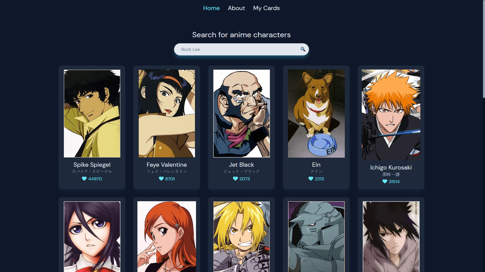

# anime-characters-123



**The app:** ✨ https://animecharacters123.netlify.app/ ✨

Project created for [RS School React Course](https://rs.school/react/).

⚙️ Main features:

- search for an anime character
- create your own characters

## Table of Contents

1. [Technologies](#technologies)
2. [Covered topics](#covered-topics)
   1. [Week 1 - Class components, React Router, Unit tests](#week-1---class-components-react-router-unit-tests)
   1. [Week 2 - Forms using uncontrolled components (with refs)](#week-2---forms-using-uncontrolled-components-with-refs)
   1. [Week 3 - React Hook Form, Functional components](#week-3---react-hook-form-functional-components)
   1. [Week 4 - API](#week-4---api)
   1. [Week 5 - Redux Toolkit, RTK Query](#week-5---redux-toolkit-rtk-query)
3. [Local setup](#local-setup)
   1. [Additional commands](#additional-commands)
4. [Sources](#sources)

## Technologies

- Node 19.9
- React 18.2
- TypeScript 4.9
- Redux Toolkit 1.9
- Tailwind CSS 3.2
- Vite 4.2
- Vitest 0.29
- React Router 6.9
- React Hook Form 7.43
- Zod 3.21
- Framer Motion 10.11

## Covered topics

### Week 1 - Class components, React Router, Unit tests

- task: https://github.com/rolling-scopes-school/tasks/tree/master/react/modules/module01
- branch with solution: https://github.com/g0sie/rs-react/tree/week-1

### Week 2 - Forms using uncontrolled components (with refs)

- task: https://github.com/rolling-scopes-school/tasks/tree/master/react/modules/module02
- branch with solution: https://github.com/g0sie/rs-react/tree/week-2

### Week 3 - React Hook Form, Functional components

- task: https://github.com/rolling-scopes-school/tasks/tree/master/react/modules/module03
- branch with solution: https://github.com/g0sie/rs-react/tree/week-3

### Week 4 - API

- task: https://github.com/rolling-scopes-school/tasks/tree/master/react/modules/module04
- branch with solution: https://github.com/g0sie/rs-react/tree/week-4

### Week 5 - Redux Toolkit, RTK Query

- task: https://github.com/rolling-scopes-school/tasks/tree/master/react/modules/module05
- branch with solution: https://github.com/g0sie/rs-react/tree/week-5

## Local setup

First, install dependencies.

```
npm i
```

Then you can start the server.

```
npm run dev
```

### Additional commands

- linting

```
npm run lint
```

- testing

```
npm test
```

## Sources

- Modal animation - https://www.youtube.com/watch?v=SuqU904ZHA4
- Loader - https://uiverse.io/Nawsome/blue-dragon-70
